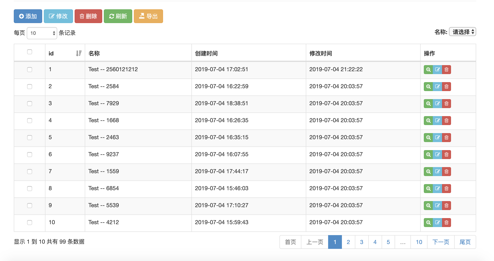

meTables.js 基于 jquery.dataTables.js 表格
===================================

### 简介

因为jquery.dataTables.js 只是显示数据，没有自带的编辑、新增、删除数据的功能，需要依靠扩展实现，所以自己写了一个编辑、新增、删除数据的功能

### 依赖声明
* jQuery v2.1.1 
* Bootstrap v3.2.0
* DataTables 1.10.15
* layer-v2.1
* jQuery Validation Plugin - v1.14.0

### 简单使用

#### html
```html
<!-- 按钮信息 -->
<p id="me-table-buttons"></p>

<!-- 表格数据 -->
<table class="table table-striped table-bordered table-hover" id="show-table"></table>

<script>
/**
 * 简单配置说明
 * title 配置表格名称
 * table DataTables 的配置 
 * --- columns 中的 value, search, edit, defaultOrder, hide, view, export 是 MeTables 的配置
 * ------ value 为编辑表单radio、select, checkbox， 搜索的表单的select 提供数据源,格式为一个对象 {"值": "显示信息"}
 * ------ search 搜索表单配置(不配置不会生成查询表单), type 类型支持 text, select 其他可以自行扩展
 * ------ edit 编辑表单配置（不配置不会生成编辑表单）, 
 * --------- type 类型支持hidden, text, password, file, radio, select, checkbox, textarea 等等 
 * --------- meTables.inputCreate 等后缀函数为其生成表单元素，可以自行扩展
 * --------- 除了表单元素自带属性，比如 required: true, number: true 等为 jquery.validate.js 的验证配置
 * --------- 最终生成表单元素 <input name="name" required="true" number="true" />
 * ------ defaultOrder 设置默认排序的方式(有"ace", "desc")
 * ------ hide 该列是否需要隐藏 true 隐藏
 * 其他配置查看 MeTables 配置
 */

// 自定义表单处理方式
$.extend($.fn.meTables, {
    /**
     * 定义编辑表单(函数后缀名Create)
     * 使用配置 edit: {"type": "email", "id": "user-email"}
     * edit 里面配置的信息都通过 params 传递给函数
     */
    "emailCreate": function(params) {
        return '<input type="email" name="' + params.name + '"/>';
    },
    
    /**
     * 定义搜索表达(函数后缀名SearchCreate)
     * 使用配置 search: {"type": "email", "id": "search-email"}
     * search 里面配置的信息都通过 params 传递给函数
     */
    "emailSearchCreate": function(params) {
        return '<input type="text" name="' + params.name +'">';
    }
});


var m = $("#show-table").MeTables({
    title: "地址信息",
    table: {
        columns:[
            {
                title: "id", 
                data: "id", 
                defaultOrder: "desc",
                // type 类型默认为text,可以不写
                edit: {required: true, number: true}
            },
            {
                title: "地址名称", 
                data: "name", 
                edit: {required: true, rangelength: "[2, 40]"},
                search: {type: "text"},
                sortable: false
            },
            {
                title: "父类ID", 
                data: "pid", 
                value: {"0": "中国", "1": "上海"},
                edit: {required: true, number: true},
                search: {"type":"select"}
            }
        ]
    }
});

</script>
```

#### 生成视图


#### 关于搜索条件和排序字段的处理

搜索表单的查询信息以及排序条件都会拼接到dataTables 提交数据中

>请求参数说明(请求方式为get)

 名称     |  类型 | 说明
:--------|:------|:----
draw     | int   | 请求次数
offset   | int   | 分页偏移量(对应mysql 的 offset)
limit    | int   | 分页数据条数( 对应mysql 的 limit)
columns  | array | 表格的字段信息(data 为 null 忽略)
filters  | array | 查询的参数信息,定义了defaultFilters 数据也在里面
orderBy  | string| 排序条件(排序字段 排序方式： id asc)

#### 服务器数据的处理(PHP代码)

```php
// 默认使用get 请求参数

// 请求次数
$draw = isset($_GET['draw']) ? (int)$_GET['draw'] : 0;

// 查询参数(查询条件排序字段)
$filters = isset($_GET['filters']) ? $_GET['filters'] : [];

// 查询开始位置(分页启始位置)
$offset = isset($_GET['offset']) ? (int)$_GET['offset'] : 0; 

// 查询数据条数
$limit = isset($_GET['limit']) ? (int)$_GET['limit'] : 10;

// 排序的字段和方式
$orderBy = isset($_GET['orderBy']) ? trim($_GET['orderBy']) : 'id desc';

// 处理查询条件
if (!empty($filters)) {
    /**
     * 这里的 $filters 其实就是前台搜索表单中的数据(查询字段对应值的一个数组)
     * ['id' => '1', 'name' => '湖南']
     */
     
    $arrWhere = $bindParams = [];
    foreach ($filter as $key => $value) {
        // 具体对应查询条件根据实际情况处理，我这里使用最简单的处理方式('=')
        $arrWhere[]   = '`'.$key.'` = ?';
        $bindParams[] = trim($value);
    }
     
    $where = ' WHERE ' . implode(' AND ', $arrWhere);
} else {
    $where      = '';
    $bindParams = [];
}

// 实例化PDO类
$pdo   = new PDO('mysql:host=127.0.0.1;port=3306;dbname=test;charset=utf8', 'user', 'password');
$table = 'china';

// 查询数据总条数
$intTotal = 0;
$strCount = 'SELECT COUNT(*) AS `total` FROM `' . $table . '` ' . $where;
$stem     = $pdo->prepare($strCount);
if ($stem->execute($bindParams)) {
    $array    = $stem->fetch(PDO::FETCH_ASSOC);
    $intTotal = (int)$array['total'];
}

// 查询具体数据
if ($intTotal > 0) {
    $strSql = 'SELECT * FROM `' . $table . '` ' . $where . ' ORDER BY `' . $field . '` ' . $sort . ' LIMIT '.$intStart.','.$intLength;
    $stem   = $pdo->prepare($strSql);
    if ($stem->execute($bindParams)) {
        $data = $stem->fetchAll(PDO::FETCH_ASSOC);
    }
} else {
    $data = [];
}

// 返回json数据
header('Content-Type: application/json; charset=utf-8');
exit(json_encode([
    'draw'            => 0,
    'data'            => [
        'id'   => 1,
        'name' => 'name'
    ],
    'recordsFiltered' => 99,
    'recordsTotal'    => 99  
], 320));

```

#### 服务器返回数据说明
* 查询返回 json
```
{
    draw: 1,                   // 查询次数
    recordsFiltered: 100,      // 当页数据条数
    recordsTotal: 100,        // 数据总条数 
    data: [                   // 数据
      {id: 1, name: "中国"},
      {id: 2, name: "上海"}
    ]
}
```
* 新增、修改、删除返回json
1. 处理成功
```
{
    code: 0,
    msg: "操作成功",
    data: {
        id: 1,
        name: "中国"
    }
}
```
2. 处理失败
```
{
  code: 1,
  msg: "处理失败",
  data: null
}
```
### 配置说明

>目前配置选择器都只能使用ID选择器

| 配置名称 | 字段类型 | 默认值 | 说明 |
|----------------|---------|-------------------|---------|
| title          | string  | 空字符串           |  表格标题(会在编辑和新增弹框显示)      |
| pk             | string  | id                | 数据主键值(行内编辑,和多个删除需要使用) |
| modalSelector  | string  | #table-modal      | 弹出模块框的选择器                    |
| formSelector   | string  | #edit-form        | 编辑表单的选择器                      |
| defaultFilters | object  | null              | 默认查询条件(该配置在查询和导出都会提交给服务器)|
| filters        | string  | filters           | 查询条件提交给服务器字段名称                  | 

### 请求相关配置
| 配置名称 | 字段类型 | 默认值 | 说明 |
|----------------|---------|-------------------|---------|
| isSuccess      | function | function(response) { return response.code === 0 } | 验证请求是否成功(response 为响应json 数据)
| getMessage     | function | function(response) { return response.msg; }       | 获取响应的提示信息(response 为响应 json 数据)
| urlPrefix      | string   | 空字符串    | 路由前缀     |
| urlSuffix      | string   | 空字符串    | 路由后缀     |
| url            | object   |            | 具体路由信息  |
| url.search     | string   | search     | 搜索&列表显示数据请求地址 |
| url.create     | string   | create     | 新增数据请求地址         |
| url.update     | string   | update     | 编辑数据请求地址         |
| url.delete     | string   | delete     | 删除数据请求地址         |
| url.export     | string   | export     | 导出数据请求地址         |
| url.editable   | string   | editable   | 行内编辑请求地址         |
| url.deleteAll  | string   | delete-all | 多删除请求地址           |

请求数据说明

* 新增请求数据和修改请求数据一致(就是表单中声明的字段的数据),*主键值新增和编辑的时候，请将表单编辑字段设置为隐藏字段，编辑的时候会根据表格中的数据复赋值上去*
> 需要注意的是新增的时候，表单中的隐藏字段也会提交上去,多余字段，需要后端服务器自行处理

* 查询请求数据：表单搜索数据 + 分页数据 + 默认查询数据 具体字段[查看](./#关于搜索条件和排序字段的处理)  
* 删除请求数据：就是删除该行的所有数据
* 导出请求数据：表单搜索数据 + 默认查询数据 + 导出字段信息 + 标题数据

| 字段名称 | 数据类型 | 说明|
|---------|----------|-------|
| title   | string   | 就是配置的title                                              |
| columns | array    | 导出字段信息(表格 columns 中配置了 export: false 字段不在其中)  |
| filters | array    | 查询条件信息和默认查询信息都在其中                              |

* 行内编辑请求数据： pk + name + value

| 字段名称 | 数据类型 | 说明|
|---------|----------|-------|
| pk   | mixed  | 该行主键值    |                                          
| name | string | 修改字段名称  |
| value| string | 修改后的值    |

### 默认dataTables 的配置信息

>关于dataTables 的配置都配置在table 这个配置项中(允许覆盖追加配置)

| 配置名称 | 配置类型 | 配置值 | 配置说明 |
|---------|---------|---------|---------|
| table.paging     | bool  | true               | 是否使用分页      |
| table.lengthMenu | array | [10, 30, 50, 100]  | 下拉选择分页数    |
| table.searching  | bool  | false              | 是否允许快速搜索  |
| table.ordering   | bool  | true               | 是否允许排序      |
| table.info       | bool  | true               |                  |
| table.autoWidth  | bool  | false              | 自动计算宽度      |
| table.processing | bool  | true               |                 |
| table.serverSide | bool  | true               | 是否服务器处理    |
| table.paginationType | string | full_numbers  | 分页风格          |
| table.language    | object |                  | 使用语言，默认中文 |

例子：
```
{
   table: {
       paging: true,
       lengthMenu: [10, 30, 50, 100],
       searching: false,
       ordering: true,
       info: true,
       autoWidth: false,
       processing: true,
       serverSide: true,
       paginationType: "full_numbers",
       language: $.getValue(MeTables.language, "dataTables"),
   } 
}
```      

### 搜索表单相关配置
>会根据 **table.columns** 中 **search** 配置选项生成搜索表单信息

| 配置说明 | 配置类型 | 配置值 | 配置说明 |
|----------|-------|---------|--------|
| searchHtml | string | 空字符串      | 搜索表单内容(根据配置生成的html都追加到该字符串上面)|
| searchType | string | middle       | 搜索表单位置(支持middle,top 选项)                |
| searchForm | string | #search-form | 搜索表单选择器(目前只支持id选择器)                |         
| searchInputEvent | string | blur   | 搜索表单input触发事件类型自动触发搜索(不需要为空)             |
| searchSelectEvent| string | change | 搜索表单select触发事件类型自动触发搜索(不需要为空            |
| search.render | bool   | true      | 是否需要渲染(自己写的搜索表单的话，需要设置为false) |
| search.type   | string | append    | 搜索表单searchHtml 怎么追加到表单中 |
| search.button | object | {class: "btn btn-info btn-sm", icon: "ace-icon fa fa-search"} | 搜索按钮配置

search 配置需要在 searchType 不为 middle 才会生效

### 编辑表单配置选项

| 配置名称 | 配置类型 | 配置值 | 配置说明 |
|---------|----------|------|---------|
| form.method               | string | post                 | 提交类型 |
| form.class                | string | form-horizontal      | 类名     |
| form.name                 | string | edit-form            | 表单名称  |
| formValidate              | object | 默认配置如下说明信息   | 表单验证默认配置信息|
| editFormParams.multiCols  | bool   | false                | 是否允许多列排列 |
| editFormParams.colsLength | int    | 1                    | 需要几列 |
| editFormParams.cols       | array  | [3, 9]               | 多列布局，label 和 input 布局分隔 |
| editFormParams.modalClass | string | 空字符串              | 弹出模态框的类名(多列后，没有配置modalClass 的话，默认使用大模态框)                  |

说明信息：
* form 的配置就是[HTML form](http://www.w3school.com.cn/tags/tag_form.asp) 允许设置的标签属性信息
* 默认表单验证配置信息如下就是[jquery.validate](https://jqueryvalidation.org/documentation/) 的配置信息：
```
{
    formValidate: {
        errorElement: 'div',
        errorClass: 'help-block',
        focusInvalid: false,
        highlight: function (e) {
            $(e).closest('.form-group').removeClass('has-info').addClass('has-error');
        },
        success: function (e) {
            $(e).closest('.form-group').removeClass('has-error');//.addClass('has-info');
            $(e).remove();
        }
    }
}
```

### 查看详情配置说明

| 配置名称 | 配置类型 | 配置值  | 配置说明 |
|---------|---------|--------|---------|
| viewFull               | bool   | false     | 是否弹出就全屏                         | 
| viewConfig             | object | 如下说明   | 就是layer 弹层的配置              |
| detailTable.multiCols  | bool   | false     | 是否允许多列排列                    |
| detailTable.colsLength | int    | 1         | 需要几列                            |
| detailTable.cols       | array  | [3, 9]    | 多列布局，label 和 input 布局分隔     |

* viewConfig 默认配置([layer弹层]()):
```
{
    viewConfig: {
        type: 1,
        shade: 0.3,
        shadeClose: true,
        maxmin: true,
        area: ['50%', 'auto']
    }
}
``` 
### 关于按钮组配置说明

| 配置名称 | 配置类型 | 配置值 | 配置说明 |
|---------|----------|------|---------|
| buttonHtml     | string | 空字符串          | 按钮组默认html 内容，配置的按钮都会追加到该html 后面|
| buttonSelector | string | #me-table-buttons| 容纳按钮组html 容器的选择器     |
| buttonType     | string | append           | html 怎么追加到容器里面         |
| buttons        | object |               | 按钮组配置                     |
| buttons.text   | string |                | 按钮里面文本信息               |
| buttons.icon   | string |                | 使用的图标信息                  |
| buttons.class  | string |                | 按钮的class 信息               |

默认按钮组有5个，分别是:
1. 新增(create)
2. 修改(updateAll)
3. 删除多个(deleteAll)
4. 刷新(refresh)
5. 导出(export)

使用例子(添加自定义按钮和关闭已经存在的按钮)：
```
$("#table").MeTables({
    buttons: {
        // 关闭之前存在按钮
        create: null,
        
        updateAll: null,
        
        // 自定义添加按钮
        other: {
            text: "其他按钮",
            icon: "fa fa-list",
            class: "btn btn-success other-class"
        },
        
        test: {
            text: "测试按钮",
            icon: "fa fa-users",
            class: "btn btn-info test-class"
        }
    }
});

// 自定义按钮需要自己监听点击事件
$(document).on("click", "button.other-class", function () {
    alert("点击了其他按钮");
});
```

### 三个自定义 columns 列的信息
>其实就是默认定义了table.columns 中配置信息，columns 的配置都可以追加和覆盖到默认配置中

**不需要直接配置为null或者false**
列如：
```
$("#table").MeTables({
    checkbox: null,
    number: null
});
```
#### 1.多选按钮 checkbox
配置信息：
```
{
    checkbox: {
        data: null,
        sortable: false,
        class: "center text-center",
        title: "<label class=\"position-relative\">" +
        "<input type=\"checkbox\" class=\"ace\" /><span class=\"lbl\"></span></label>",
        view: false,
        createdCell: function (td, data, array, row) {
            $(td).html('<label class="position-relative">' +
            '<input type="checkbox" class="ace" data-row="' + row + '" />' +
            '<span class="lbl"></span>' +
            '</label>');
        }
    }
}
```
#### 2.序号 number
```
{
    number: {
        title: $.getValue(MeTables.language, "meTables.number"),
        data: null,
        view: false,
        render: function (data, type, row, meta) {
            if (!meta || $.isEmptyObject(meta)) {
                return false;
            }
        
            return meta.row + 1 + meta.settings._iDisplayStart;
        },
        sortable: false
    }
}
```
#### 3.操作按钮 operations 
```
{
    operations: {
        width: "120px",
        defaultContent: "",
        title: $.getValue(MeTables.language, "meTables.operations"),
        sortable: false,
        data: null,
        buttons: {
            see: {
                title: $.getValue(MeTables.language, "meTables.see"),
                btnClass: "btn-success",
                operationClass: "me-table-detail",
                icon: "fa-search-plus",
                colorClass: "blue"
            },
            update: {
                title: $.getValue(MeTables.language, "meTables.update"),
                btnClass: "btn-info",
                operationClass: "me-table-update",
                icon: "fa-pencil-square-o",
                colorClass: "green"
            },
            delete: {
                title: $.getValue(MeTables.language, "meTables.delete"),
                btnClass: "btn-danger",
                operationClass: "me-table-delete",
                icon: "fa-trash-o",
                colorClass: "red"
            }
        }
    }
}
```

#### operations 中 buttons 配置说明
| 配置名称 | 配置类型  | 配置说明 |
|---------------|----------|------------ |
| title         | string   | button 名称     |
| btnClass      | string   | button class信息|
| operationClass| string   | 操作的class 信息(事件监听使用这个字段信息)
| icon          | string   | 使用的icon      |
| colorClass    | string   | 颜色class 信息  |

自定义了三个按钮：
1. 查看详情(see)
2. 编辑信息(update)
3. 删除数据(delete)

自定义添加和关闭operations buttons 的配置例子：
```
var m = $("#table").MeTables({
    operations: {
        buttons: {
            // 关闭之前的按钮
            see: null,
            
            // 添加自定义的按钮
            other: {
                title: "其他信息",
                btnClass: "btn-warning",
                operationClass: "me-table-other",
                icon: "fa fa-user",
                colorClass: "red"
            }
        }
    }
});

// 需要自己监听事件信息(注意,监听的类名需要加上 - 表格选择器去掉 #和.号的字符串)
// 这里选择器为 #table 去掉 #和.号后为 table, operationClass 为 me-table-other 那么监听的对象为 .me-table-other-table
$(document).on("click", ".me-table-other-table", function () {
    // 当前点击按钮所在的行
    var row = $(this).data("row");
    
    // 获取当前行的所有数据信息
    var data = m.table.data()[row];
    
    // 自定义处理逻辑
    console.info(data);
    // ... 
});
```
>需要自己监听事件信息(注意,监听的类名需要加上 - 表格选择器去掉 #和.号的字符串)
这里选择器为 #table 去掉 #和.号后为 table, operationClass 为 me-table-other 那么监听的对象为 **.me-table-other-table*

### 所有默认配置
```
    //  默认配置信息
    MeTables.defaults = {
        title: "",                      // 表格的标题
        pk: "id",		                // 行内编辑pk索引值
        modalSelector: "#table-modal",  // 编辑Modal选择器
        formSelector: "#edit-form",	    // 编辑表单选择器
        defaultFilters: null,			// 默认查询条件 {id: 1, type: 2}
        filters: "filters",             // 查询参数名称

        // 请求相关
        isSuccess: function (json) {
            return json.code === 0;
        },

        getMessage: function (json) {
            return json.msg;
        },

        // 搜索相关
        searchHtml: "",				    // 搜索信息额外HTML
        searchType: "middle",		    // 搜索表单位置
        searchForm: "#search-form",	    // 搜索表单选择器
        searchInputEvent: "blur",       // 搜索表单input事件
        searchSelectEvent: "change",    // 搜索表单select事件
        // 搜索信息(只对searchType !== "middle") 情况
        search: {
            render: true,
            type: "append",
            button: {
                "class": "btn btn-info btn-sm",
                "icon": "ace-icon fa fa-search"
            }
        },

        fileSelector: [],			// 上传文件选择器

        // 编辑表单信息
        form: {
            "method": "post",
            "class": "form-horizontal",
            "name": "edit-form"
        },

        // 编辑表单验证方式
        formValidate: {
            errorElement: 'div',
            errorClass: 'help-block',
            focusInvalid: false,
            highlight: function (e) {
                $(e).closest('.form-group').removeClass('has-info').addClass('has-error');
            },
            success: function (e) {
                $(e).closest('.form-group').removeClass('has-error');//.addClass('has-info');
                $(e).remove();
            }
        },

        // 表单编辑其他信息
        editFormParams: {			// 编辑表单配置
            multiCols: false,       // 是否多列
            colsLength: 1,          // 几列
            cols: [3, 9],           // label 和 input 栅格化设置
            modalClass: "",			// 弹出模块框配置
            modalDialogClass: ""	// 弹出模块的class
        },

        // 关于详情的配置
        viewFull: false, // 详情打开的方式 1 2 打开全屏
        viewConfig: {
            type: 1,
            shade: 0.3,
            shadeClose: true,
            maxmin: true,
            area: ['50%', 'auto']
        },

        detailTable: {                   // 查看详情配置信息
            multiCols: false,
            colsLength: 1
        },

        // 关于地址配置信息
        urlPrefix: "",
        urlSuffix: "",
        url: {
            search: "search",
            create: "create",
            update: "update",
            delete: "delete",
            export: "export",
            upload: "upload",
            editable: "editable",
            deleteAll: "delete-all"
        },

        // dataTables 表格默认配置对象信息
        table: {
            paging: true,
            lengthMenu: [10, 30, 50, 100],
            searching: false,
            ordering: true,
            info: true,
            autoWidth: false,
            processing: true,
            serverSide: true,
            paginationType: "full_numbers",
            language: $.getValue(MeTables.language, "dataTables"),
        },

        // 开启行处理
        editable: null,
        editableMode: "inline",

        // 默认按钮信息
        buttonHtml: "",
        // 按钮添加容器
        buttonSelector: "#me-table-buttons",
        // 按钮添加方式
        buttonType: "append",
        // 默认按钮信息
        buttons: {
            create: {
                icon: "ace-icon fa fa-plus-circle blue",
                class: "btn btn-white btn-primary btn-bold"
            },
            updateAll: {
                icon: "ace-icon fa fa-pencil-square-o orange",
                class: "btn btn-white btn-info btn-bold"
            },
            deleteAll: {
                icon: "ace-icon fa fa-trash-o red",
                class: "btn btn-white btn-danger btn-bold"
            },
            refresh: {
                func: "search",
                icon: "ace-icon fa  fa-refresh",
                class: "btn btn-white btn-success btn-bold"
            },
            export: {
                icon: "ace-icon glyphicon glyphicon-export",
                class: "btn btn-white btn-warning btn-bold"
            }
        }

        // 需要序号
        , number: {
            title: $.getValue(MeTables.language, "meTables.number"),
            data: null,
            view: false,
            render: function (data, type, row, meta) {
                if (!meta || $.isEmptyObject(meta)) {
                    return false;
                }

                return meta.row + 1 + meta.settings._iDisplayStart;
            },
            sortable: false
        }

        // 需要多选框
        , checkbox: {
            data: null,
            sortable: false,
            class: "center text-center",
            title: "<label class=\"position-relative\">" +
                "<input type=\"checkbox\" class=\"ace\" /><span class=\"lbl\"></span></label>",
            view: false,
            createdCell: function (td, data, array, row) {
                $(td).html('<label class="position-relative">' +
                    '<input type="checkbox" class="ace" data-row="' + row + '" />' +
                    '<span class="lbl"></span>' +
                    '</label>');
            }
        }
        // 操作选项
        , operations: {
            width: "120px",
            defaultContent: "",
            title: $.getValue(MeTables.language, "meTables.operations"),
            sortable: false,
            data: null,
            buttons: {
                see: {
                    title: $.getValue(MeTables.language, "meTables.see"),
                    btnClass: "btn-success",
                    operationClass: "me-table-detail",
                    icon: "fa-search-plus",
                    colorClass: "blue"
                },
                update: {
                    title: $.getValue(MeTables.language, "meTables.update"),
                    btnClass: "btn-info",
                    operationClass: "me-table-update",
                    icon: "fa-pencil-square-o",
                    colorClass: "green"
                },
                delete: {
                    title: $.getValue(MeTables.language, "meTables.delete"),
                    btnClass: "btn-danger",
                    operationClass: "me-table-delete",
                    icon: "fa-trash-o",
                    colorClass: "red"
                }
            }
        },
        version: "1.0.0",
        author: {
            name: "liujinxing",
            email: "jinxing.liu@qq.com",
            github: "https://github.com/myloveGy"
        }
    };
```

全局默认配置修改
```
    // 修改默认配置
    $.fn.meTables.defaults.table.dom = "t<'row'<'table-page col-sm-4'li><'col-sm-8'p>>";
    $.fn.meTables.defaults.url.create = 'store';
    $.fn.meTables.defaults.url.delete = 'destroy';
    $.fn.meTables.defaults.number = null;
    $.fn.meTables.defaults.checkbox = null;
```
全局添加自定义表单编辑信息
```
$.extend($.fn.meTables, {
    /**
     * 多选
     * @param params
     * @param d
     * @returns {string}
     */
    checkboxCreate: function (params, d) {
        html = '';
        if (d && this.isObject(d)) {
            var o = params.all;
            delete params.all;
            delete params.divClass;
            params["class"] = "ace m-checkbox";
            params = this.handleParams(params);
            if (o) {
                html += '<div class="checkbox">' +
                    '<label>' +
                    '<input type="checkbox" class="ace checkbox-all" onclick="var isChecked = $(this).prop(\'checked\');$(this).parent().parent().parent().find(\'input[type=checkbox]\').prop(\'checked\', isChecked);" />' +
                    '<span class="lbl"> ' + meTables.fn.getLanguage("sSelectAll") + ' </span>' +
                    '</label>' +
                    '</div>';
            }
            for (i in d) {
                html += '<div class="checkbox">' +
                    '<label>' +
                    '<input type="checkbox" ' + params + ' value="' + i + '" />' +
                    '<span class="lbl"> ' + d[i] + ' </span>' +
                    '</label>' +
                    '</div>';
            }
        }

        return html;
    }
});
```
